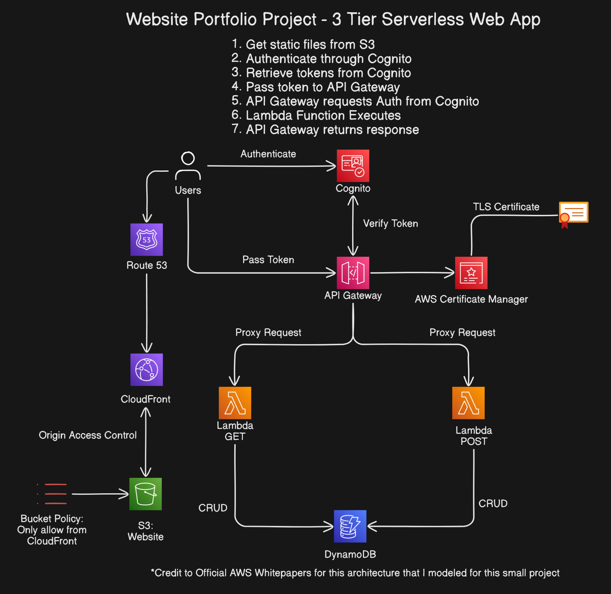

# Website Portfolio Project

A serverless website deployed on AWS to showcase my projects

## Notes

* Cognito was not used in this project. I placed it in the diagram to show how I would implement it.

## Technologies and Services Used

* AWS Services
    - CloudFront
    - S3
    - Route 53
    - Lambda
    - DynamoDB
* Other Technologies
    - Git
    - GitHub

See full details of how I created this project and other projects on my live website here: [Portfolio Website](https://shaneshimizu.com)

